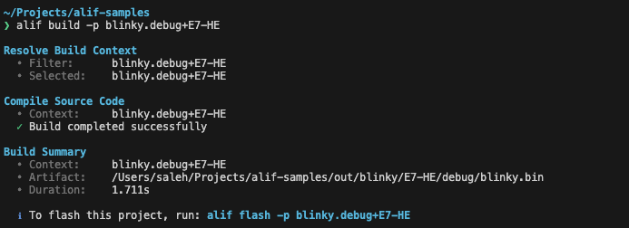
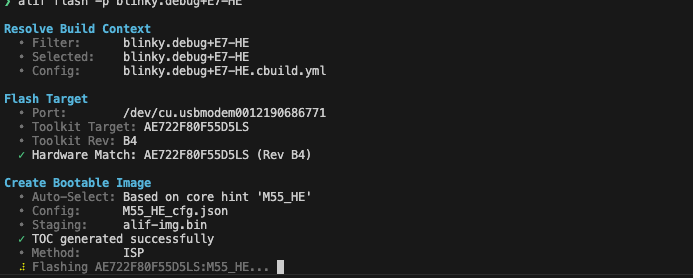

# Alif CLI

**Alif CLI** is a powerful command-line interface designed to streamline the development workflow for Alif Semiconductor devices (e.g., AK-E7-AIML). It abstracts the complexity of underlying tools—such as CMSIS Toolbox and Alif Security Toolkit—providing a unified interface for building, signing, and flashing applications.

## Installation

### Quick Install (macOS/Linux)
```bash
./install.sh
```
See the `scripts/` directory for advanced packaging options.

## Commands

### `alif build`
**Builds and packages your application.**

This command compiles the project source code using the CMSIS build system (`cbuild`). It resolves the build context (Target + Build Type) and prepares the binary artifacts. The CLI also supports cleaning the project before building.

**Usage:**
```bash
alif build -p <project_name> [flags]
```
- `-p, --project`: Specify the project name or build context (e.g., `blinky` or `blinky.debug+E7-HE`).
- `--clean`: Clean artifacts before building.

**About Build Contexts:**
The build context name follows the format `<project>.<build-type>+<target>` (e.g., `blinky.debug+E7-HE`). These are automatically read from your solution's `*.csolution.yml` file.

You can provide a partial name (e.g., `-p blinky`) to filter:
- If a single match is found, it is automatically selected.
- If multiple matches are found, the CLI will list all possible contexts for you to choose from interactively.

---

### `alif flash`
**Safety-first firmware programming.**

This command handles the end-to-end flashing process with built-in hardware safety checks. It:
1.  **Toolkit Synchronization**: Automatically configures the Alif Security Toolkit (`global-cfg.db`) to match your project's target Part Number and Revision.
2.  **Live Hardware Verification**: Probes the connected board via the `maintenance` tool to retrieve the internal silicon ID.
3.  **Fail-Fast Security**: Stops the process immediately if the connected hardware doesn't match the project target (e.g., trying to flash an E7 image to an E8 board).
4.  **Bootable Image Generation**: Automatically creates or updates the signed bootable image (TOC) with correct memory addresses.
5.  **Clean Programming**: Programs the signed image to the device's MRAM via ISP (serial) or JTAG.

**Usage:**
```bash
alif flash -p <project_name> [flags]
```
- `-p, --project`: Specify the project to flash.
- `-e, --erase`: Explicitly erase the device application area before writing (Default: No erase).
- `--no-verify`, `--nv`: Skip the live hardware verification step.
- `-m, --method`: Specify the connection method (`ISP` or `JTAG`).
- `-v, --verbose`: Enable detailed log output.

## Example Workflow

The following visual guide demonstrates the workflow for building and flashing the **Blinky** project (from [Alif Samples](https://github.com/saleh-mehdikhani/alif_samples)) to an **AK-E7-AIML (HW: D3)** devkit.

### 1. Build Completed
Run `alif build -p blinky` to compile the project. The CLI resolves the context (e.g., `blinky.debug+E7-HE`) and generates the binary.



### 2. Flashing & Verification
Run `alif flash -p blinky`. The tool identifies the serial port, **probes the hardware** to ensure it matches the target (e.g., `AE722F80F55D5LS`), and synchronizes the toolkit settings. It then creates the bootable image and begins the flash operation.



### 3. Flash Successful
Upon completion, the CLI confirms that the firmware has been successfully programmed. If you used the `-e` flag, the device area was erased first.


